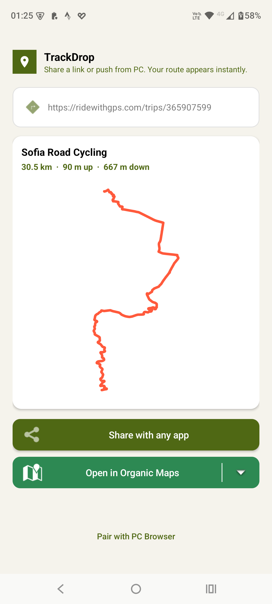
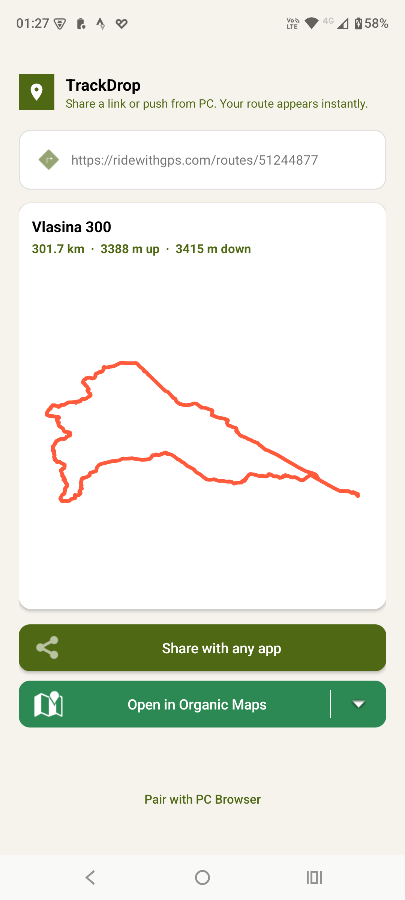
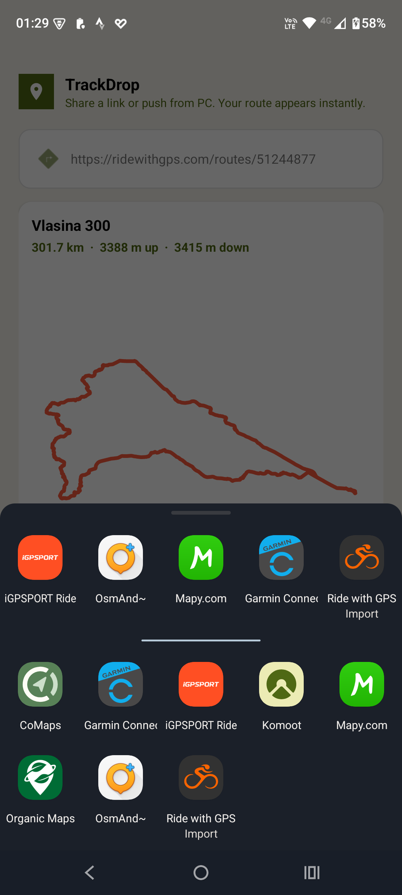
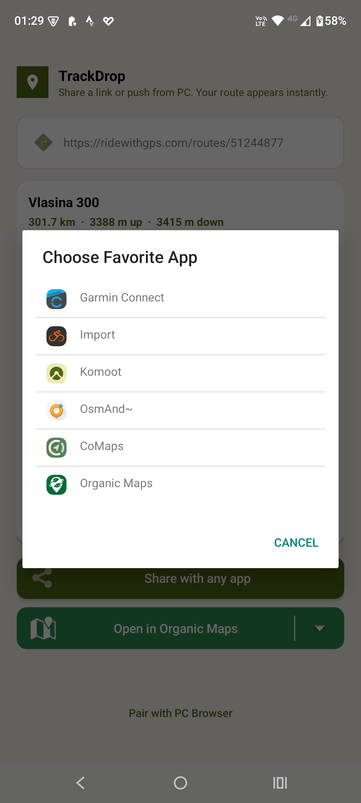

# TrackDrop

> Share a route from Komoot or RideWithGPS, drop it into any GPX-capable app — no file juggling required.

[](LICENSE)
[](https://kotlinlang.org/)
[](https://developer.android.com/)

TrackDrop is a lightweight, native Kotlin Android app that removes the friction of getting a GPX track from a route planner into your favorite map or sports app. Instead of exporting a file, hunting it down in your file manager, and tapping through import dialogs, you just **Share → TrackDrop → pick an app**. Done.

It also ships with a companion browser extension so you can send a route straight from your PC's browser to your phone via a push notification.

---

## The problem

Most route planners (Komoot, RideWithGPS) and most map/navigation/sports apps (Organic Maps, Strava, OsmAnd, etc.) speak GPX — but getting a track from one to the other on a phone is a chore:

1. Export the GPX from the planner.
2. Find the file in your file manager.
3. Tap it.
4. Pick an app from the system's "open with" list.
5. Hope the import works.

TrackDrop collapses all of that into a single share-sheet action.

---

## How it works

### 📱 Phone path (share sheet)

```
Komoot / RideWithGPS  →  Share  →  TrackDrop  →  pick a GPX app  →  done
```

1. In Komoot or RideWithGPS, tap **Share**.
2. Select **TrackDrop** from the share sheet.
3. TrackDrop fetches the route, shows a preview (name, distance, elevation, and a mini map).
4. Tap **Share** and pick any GPX-capable app — or tap your **favorite app** for a one-tap drop.

Because the share comes straight from the planner, private routes "just work": Komoot and RideWithGPS automatically append a share token that grants access to the track.

### 💻 PC path (browser extension)

```
Browser (Komoot/RideWithGPS)  →  TrackDrop extension  →  Firebase  →  push notification  →  phone
```

**First-time setup** (one-time pairing):

1. Open the TrackDrop app and tap **Pair with PC** to get a 6-character code (`XXX-XXX`).
2. Enter the code in the browser extension. The extension is now paired with your phone.

**Every time after that:**

1. Open a Komoot or RideWithGPS route in your browser, open the extension, and hit **Send**.
2. A notification lands on your phone — tap it and drop the track into any GPX app.

> ⚠️ **Private routes via the browser:** The share-sheet path automatically includes an access token, but the browser extension can't always see one. If you're viewing a private route, the extension will warn you and ask you to open the route's **share link** instead.

---

## Features

- **Share-sheet intake** — registers as a share target for `text/plain`, so it appears wherever you share a route link.
- **Route preview** — tour name, distance, elevation gain/loss, and an inline route sketch before you send it.
- **Favorite app** — set a default GPX app for one-tap drops; reconfigure anytime.
- **GPX 1.1 output** — generates standards-compliant GPX with metadata and elevation.
- **PC → phone push** — pair a browser extension via a one-time 6-digit code and send routes over Firebase Cloud Messaging.
- **Lightweight & private** — native Kotlin, no ads, no analytics, no tracking. Only `INTERNET` and `POST_NOTIFICATIONS` permissions.

---

## Supported route providers

| Provider | Public routes | Private routes |
| --- | --- | --- |
| **Komoot** | ✅ | ✅ (share token via share sheet) |
| **RideWithGPS** | ✅ | ✅ (privacy code / share link) |

More providers (Strava, AllTrails, etc.) may be added in the future.

---

## Screenshots

<p float="left">
  
  
  
  
</p>

---

## Project structure

```
.
├── app/                 # Android application (Kotlin)
│   └── src/main/
│       ├── java/com/tuntori/trackdrop/
│       │   ├── MainActivity.kt              # UI, share-intent & pairing handling
│       │   ├── TrackDropMessagingService.kt # Firebase push handler
│       │   ├── KomootService.kt             # Komoot API integration
│       │   ├── RideWithGpsService.kt        # RideWithGPS API integration
│       │   ├── RoutePreviewView.kt          # Inline route visualization
│       │   └── ...
│       └── AndroidManifest.xml
├── extension/           # Chrome browser extension (Manifest v3)
│   ├── manifest.json
│   ├── popup.html
│   └── popup.js
├── backend/             # Firebase Cloud Functions (Node.js)
│   └── functions/index.js
├── PlayStore/           # Store screenshots & assets
├── privacy-policy.md
├── data-deletion.md
└── LICENSE
```

A deeper, implementation-focused breakdown lives in [`PROJECT_DOCUMENTATION.md`](PROJECT_DOCUMENTATION.md).

---

## Tech stack

- **Android app**: Native Kotlin. Firebase Cloud Messaging is the only external service dependency.
- **Browser extension**: Manifest v3, vanilla JS, Chrome storage.
- **Backend**: Firebase Cloud Functions (Node.js) + Realtime Database for one-time pairing codes.

---

## Build & install

### Android app

Prerequisites: Android Studio, JDK 17, and a Firebase project.

1. Add your Firebase config to `app/google-services.json` (see the [Firebase console](https://console.firebase.google.com/)).
2. Build from Android Studio, or from the command line:

   ```bash
   ./gradlew assembleDebug      # debug APK
   ./gradlew assembleRelease    # release APK (needs key.properties for signing)
   ```

   Release signing reads `key.properties` at the repo root (not committed). Without it, the release build won't be signed.

### Browser extension

1. Open `chrome://extensions/` in Chrome or any Chromium browser.
2. Enable **Developer mode** (top-right toggle).
3. Click **Load unpacked** and select the `extension/` folder.
4. Open the extension, enter the pairing code shown in the TrackDrop app, and you're paired.

### Firebase backend

The backend is a small set of Cloud Functions (`sendTrack`, `pairDevice`, `registerPairingCode`) plus a Realtime Database path for pairing codes.

```bash
cd backend/functions
npm install
npm run deploy
```

You'll need the Firebase CLI installed and authenticated (`firebase login`). Enable **Realtime Database** in your Firebase project. The functions expect the database path `pairing_codes/{code}` to store one-time `fcm_token` mappings.

---

## Privacy & permissions

TrackDrop collects no personal data and includes no analytics or ads. The app requests only two permissions:

- `INTERNET` — to fetch route data from Komoot/RideWithGPS.
- `POST_NOTIFICATIONS` — to alert you when a track is pushed from the PC extension (Android 13+).

Pairing codes are random, one-time use, and deleted immediately after a successful pair. Full details: [`privacy-policy.md`](privacy-policy.md). Data deletion instructions: [`data-deletion.md`](data-deletion.md).

---

## Feedback

Bug reports and feature ideas are welcome — please open an issue on GitHub.

---

## License

Released under the **MIT License** — see [`LICENSE`](LICENSE).